# SRT2CSV
Read in a .srt file, clean the data, and export to a .csv file for upload to ANKI. 

This script currently only supports Spanish & German fully, but the spaCy library and PyMultiDictionary offer support for various other languages. The main purpose of this project was to create an easier workflow that would allow me to take the subtitle files for shows that I watch and quickly identify the words that I don't know to expand my ANKI deck. Individual word tokens are extracted from each row of a dataframe and, if they do not already appear in a "stop word" file, will be added to a csv file in the format: 

original subtitle sentence with bolded and highlighted word | word [pos] : definition | tags

Example Output:

No quiero que sea <mark><b>lunes</b></mark>. | lunes [Noun]:En el diccionario castellano lunes significa primer día de la semana, segundo de la semana litúrgica.	| spanish,es,sentence::mining,La Caza,sentence::recognition

## USAGE
(1) The original .srt file includes the subtitle number, the start and end times, and other features such as tags that will need to be removed. 

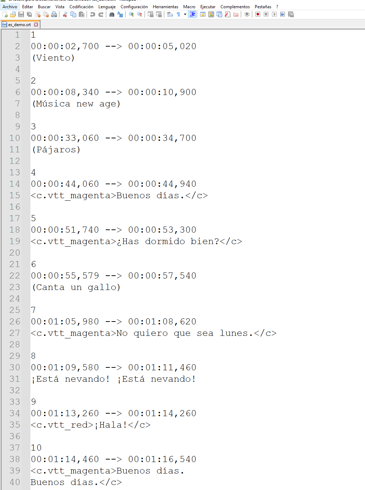
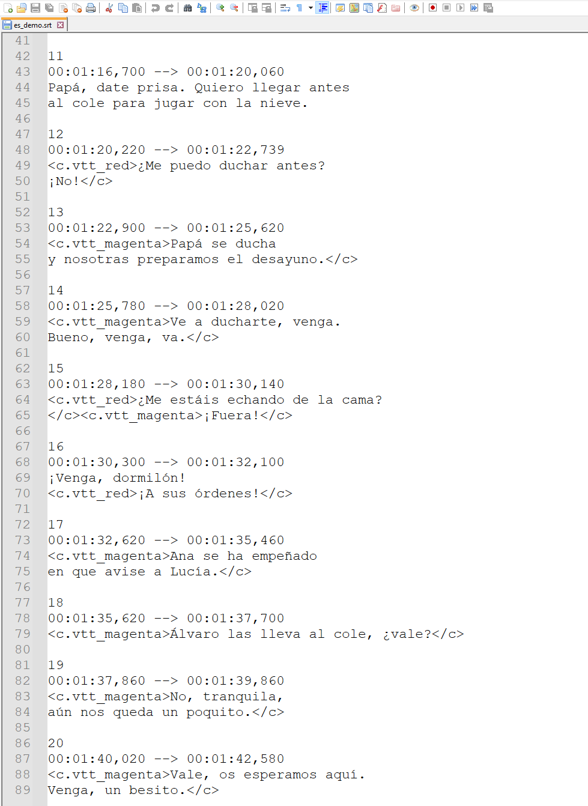

(2) After loading the subtitles with the pysrt library you get a SubRipFile object. 

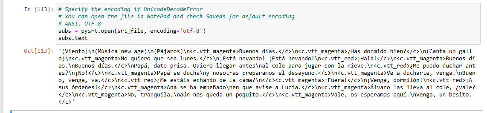

(3) The formatting is removed with the remove_formatting function and you return a cleaner SubRipFile object.

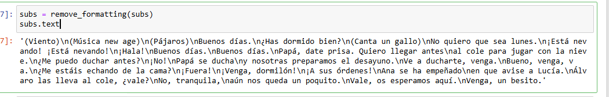

(4) Using that SubRipFile's text attribute you can then create the first dataframe to inspect it for further areas to clean. In this dataframe you can note that there are still newline characters "\n" that appear on a few lines. 

(5) You can do some basic exploratory data analysis on the dataframe to see the top 5 rows, the total rows and columns, the data type, unique values, and the most frequent values. 

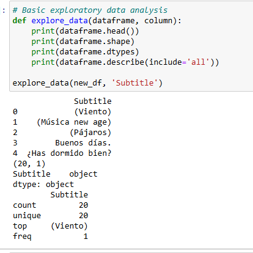

(6) Removing the newline character. 

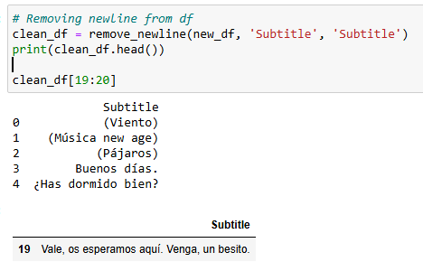

(7) Breaking down the text into individual words through word tokenization will be vital for identifying words that I do not know. 

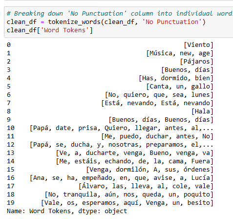

(8) Tokenizing the sentences. Currently there is not any sentiment analysis, but the full sentences will be needed to perform this step. 

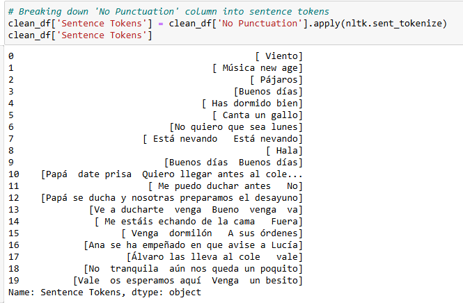

(9) Stop words are loaded from the nltk.corpus library and you can extend that list to include your own words. Character names and city names do not need to be added to ANKI for study so they can be filtered out. 

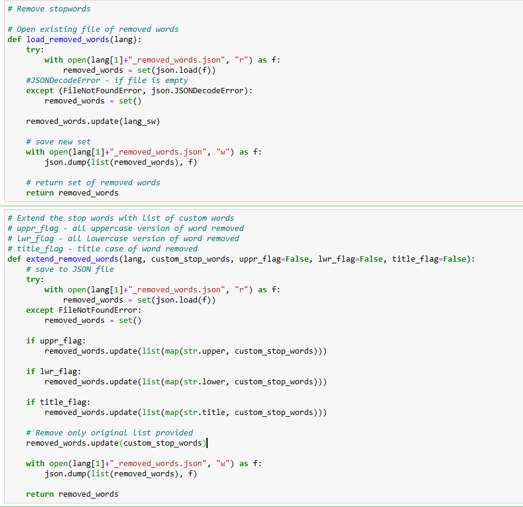
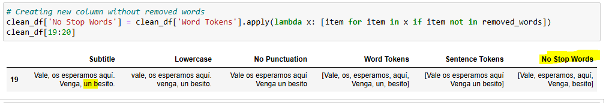

(10) You can get a visual overview of the "x" most frequent words so you know which words to focus on learning first. 

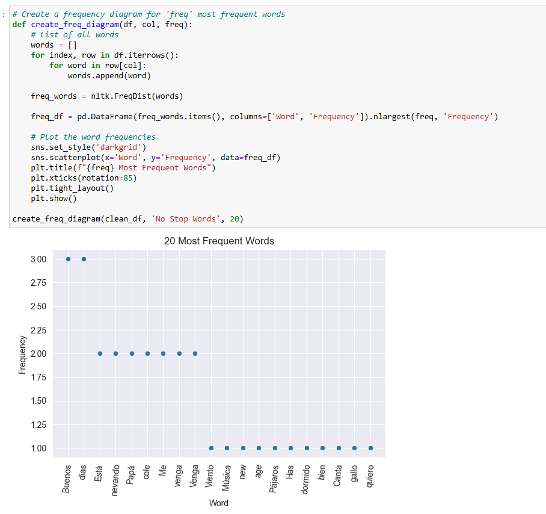

(11) If you want to see the full subtitle lines for one of those most frequent words you can use the find_word function. 

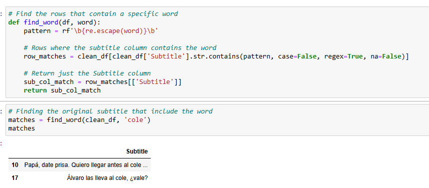

(12) The Educalingo dictionary defaults to a mix of English and the target language's definitions. For my purposes I only wanted to see the definition in the target language. 

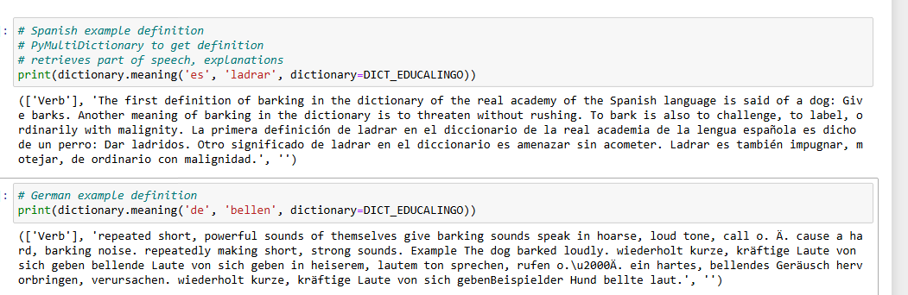

(13) A function is used to chunk sections of the definition, use LangDetect to see if it's the target language and if so return only that section of the definition.

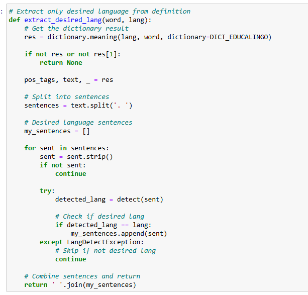

(14) Another issue with Educalingo is that the definition doesn't include the article of a noun, which is crucial at the time of learning a word in gendered languages like Spanish(el,la) and German (der, die, das). SpaCy includes the gender as part of the token, but the actual article has to be specified. 

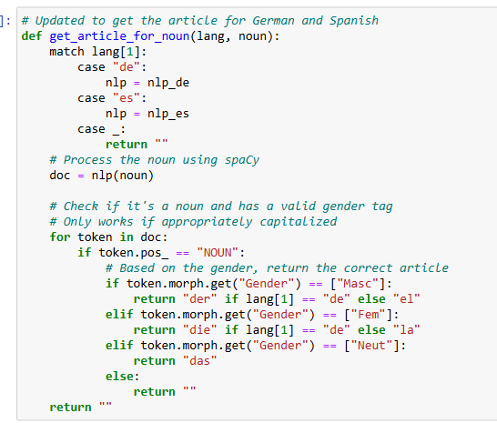

(15) It's better to use the base word with Educalingo because often the definition is tied to this word (as opposed to the plural of a noun or the conjugated form of a verb). 

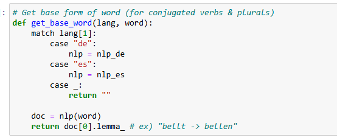

(16) Constructing the csv file by iterating through all words in the specified column 'No Stop Words'. For each word that is unknown I look up all the sentences in the dataframe that also include that word. Each entry is stored as a string and added to a list that is then turned into a new dataframe and exported to a csv file. 

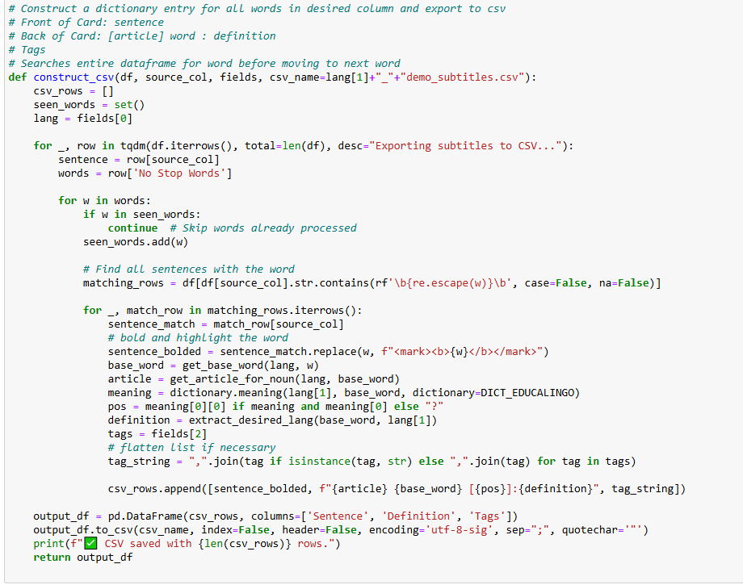

(17) In the language learning community there is the n+1 principle where you should use comprehensible input when learning a language that is just slightly more difficult than what you can already do. This can be applied to the 'No Stop Words' column by choosing to only add a sentence to the csv if there is only 1 unknown word (although there is the option for the user to expand this to 'x' desired words). 

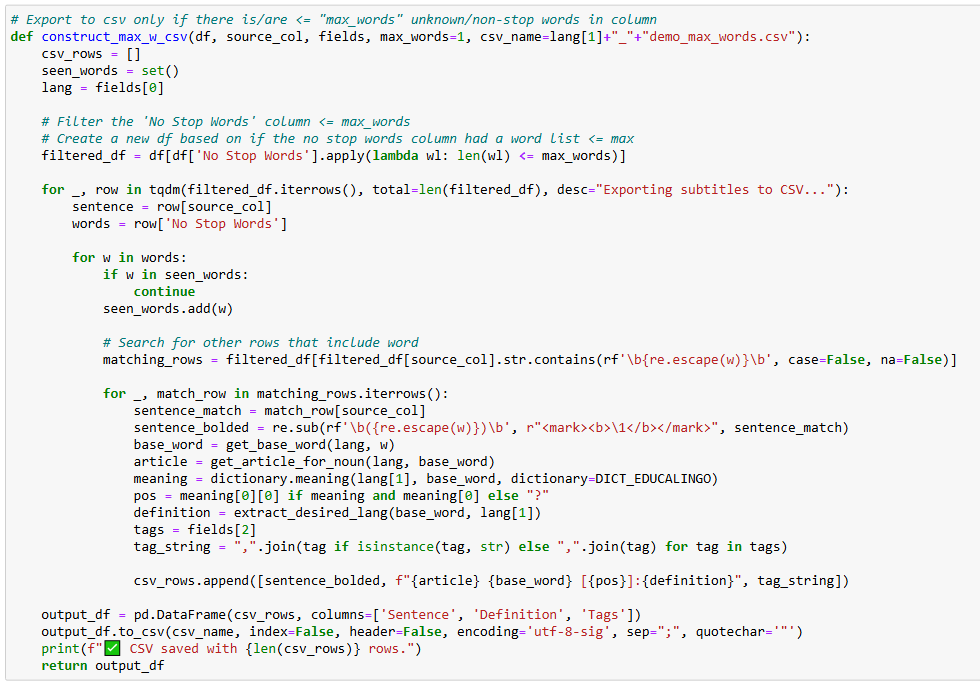

## NOTES / LIMITATIONS

- Notepad++ convert ANSI to UTF-8 for special characters
- Seems to need to be UTF-8 BOM in order to preserve special characters
- Hinglish doesn't have an official language code. 
- On occasion the Educalingo library is unable to find a definition for the word. 
  ex) Pájaros [?]:None , Buenos [?]:None
    - This is possibly due to the definition being linked to the stem that is singular as well as a problem with the first letter being uppercase.
- Perhaps the biggest limitation with the approach of this project is that it does not account for idioms or slang that may combine previously known/stop words that result in a completely different meaning. For this reason I combine a phrase dictionary and book of idioms in my personal studies. 
  ex) Mi media naranja. ("My better half." - Literally "My half orange.")
    
  
## FUTURE IMPROVEMENTS
- Adding sentiment analysis on the sentences
- Adding a category tag for each sentence
- Creating word clouds (for categories such as family & friends, outside & sports, cooking, etc.)
- Changing the educalingo dictionary to web scraping an actual dictionary for better definitions and articles for nouns?
- Extending the verb definition to include tense -> go deeper into spaCy lemmatization
- Adding support for more languages

