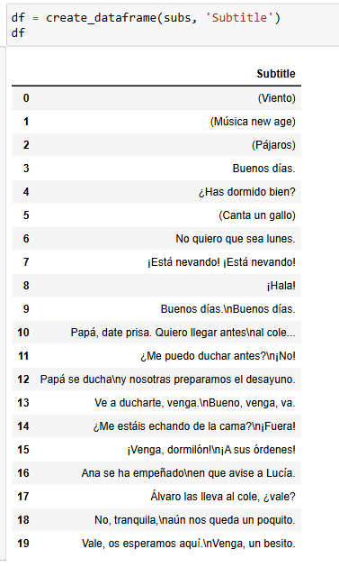

# SRT2CSV
Read in a .srt file, clean the data, and export to a .csv file for upload to ANKI. 

This script currently only supports Spanish & German fully, but the spaCy library and PyMultiDictionary offer support for various other languages. The main purpose of this project was to create an easier workflow that would allow me to take the subtitle files for shows that I watch and quickly identify the words that I don't know to expand my ANKI deck. Individual word tokens are extracted from each row of a dataframe and, if they do not already appear in a "stop word" file, will be added to a csv file in the format: 

original_subtitle_sentence with bolded and highlighted word | word [pos] : definition | tags

Example Entry:
No quiero que sea <mark><b>lunes</b></mark>. | lunes [Noun]:En el diccionario castellano lunes significa primer día de la semana, segundo de la semana litúrgica.	| spanish,es,sentence::mining,La Caza,sentence::recognition

## USAGE
(1) The original .srt file includes the subtitle number, the start and end times, and other features such as tags that will need to be removed. 

(2) After loading the subtitles with the pysrt library you get a SubRipFile object. 

(3) The formatting is removed with the remove_formatting function and you return a cleaner SubRipFile object.

(4) Using that SubRipFile's text attribute you can then create the first dataframe to inspect it for further areas to clean. In this dataframe you can note that there are still newline characters "\n" that appear on a few lines. 

(5) You can do some basic exploratory data analysis on the dataframe to see the top 5 rows, the total rows and columns, the data type, unique values, and the most frequent values. 

(6) Removing the newline character. 

(7) Breaking down the text into individual words through word tokenization will be vital for identifying words that I do not know. 

(8) 

## NOTES / LIMITATIONS

- Notepad++ convert ANSI to UTF-8 for special characters
- Seems to need to be UTF-8 BOM in order to preserve special characters
- Hinglish doesn't have an official language code. 
- On occasion the Educalingo library is unable to find a definition for the word. 
  ex) Pájaros [?]:None , Buenos [?]:None
    - This is possibly due to the definition being linked to the stem that is singular as well as a problem with the first letter being uppercase.
- Perhaps the biggest limitation with the approach of this project is that it does not account for idioms or slang that may combine previously known/stop words that result in a completely different meaning. For this reason I combine a phrase dictionary and book of idioms in my personal studies. 
  ex) Mi media naranja. ("My better half." - Literally "My half orange.")
    
  
## FUTURE IMPROVEMENTS
- Adding sentiment analysis on the sentences
- Adding a category tag for each sentence
- Creating word clouds (for categories such as family & friends, outside & sports, cooking, etc.)
- Changing the educalingo dictionary to web scraping an actual dictionary for better definitions and articles for nouns?
- Extending the verb definition to include tense -> go deeper into spaCy lemmatization
- Adding support for more languages

